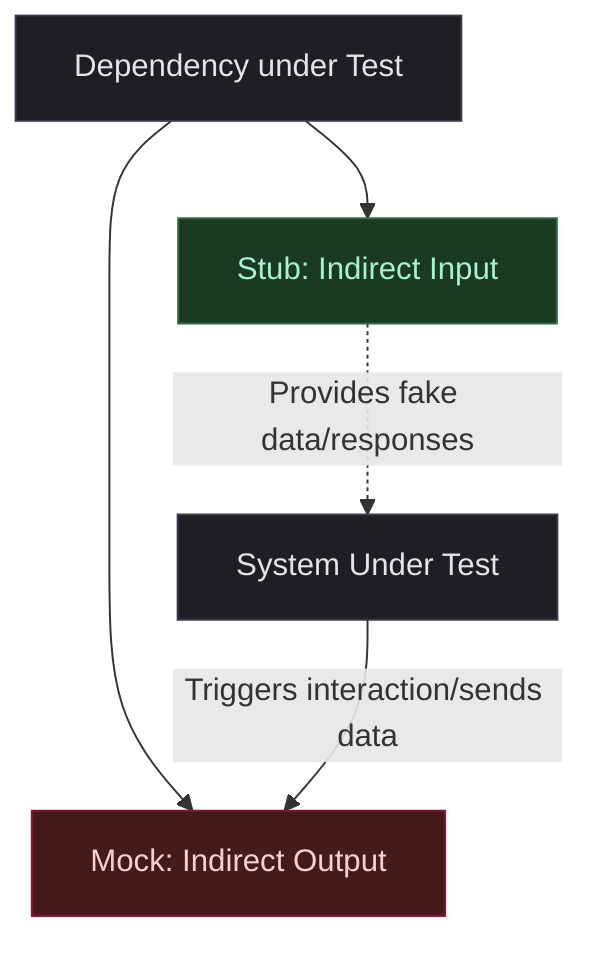

# Unit Testing Principles

These rules establish the architectural and stylistic foundation for all unit tests. They are derived from Roy Osherove's *The Art of Unit Testing* and are adapted to modern JavaScript and TypeScript projects.

---

## 1. What is a Unit Test?

A unit test is an automated piece of code that invokes a **unit of work** and checks a single assumption about its behavior.

A test is **not** a unit test if:
- It talks to a database.
- It communicates across a network.
- It touches the real file system (use virtual/in-memory mocks instead).
- It relies on system configuration or registry.
- It cannot be run in parallel with other tests.
- It must run in a specific order.

If any of these conditions are met, it is an **integration test**, not a unit test.

### Separation of Concerns in Nx

To keep the pipeline fast, deterministic, and predictable:

1.  **File Naming Suffixes**:
    *   **Unit Tests**: Use `*.test.ts` or `*.test.tsx` (e.g., `user-service.test.ts`).
    *   **Integration Tests**: Use `*.integration.test.ts` or `*.integration.test.tsx` (e.g., `user-service.integration.test.ts`).
2.  **Nx Execution Pipelines**:
    *   **Unit Tests (`test` target)**: Should run entirely in-memory, fully in parallel, with Nx Caching enabled (`cacheableOperations` in `nx.json`).
    *   **Integration Tests (`integration-test` target)**: Configure as a separate target in `project.json` (e.g., `nx run my-app:integration-test`). These may run sequentially to prevent database/state collisions and are typically executed outside of the standard unit test run.

---

## 2. Naming Conventions

To ensure the test suite serves as living documentation, test names and block descriptions must follow these standards:

### Top-Level Describe Block: Workspace-Relative Path Target
To uniquely identify the target of the test suite and prevent duplicate descriptions across different directories (e.g., when multiple directories contain a `user-service.ts` or `icon.tsx`), the top-level `describe` block must use the **workspace-relative path** of the file or component being tested.

*   **Good**: `describe('components/icon', () => { ... })`
*   **Good**: `describe('libs/user/services/user-service', () => { ... })`
*   **Bad**: `describe('Icon', () => { ... })`
*   **Bad**: `describe('UserService', () => { ... })`

### Individual Test Cases
Individual test cases must follow one of these two standards based on their purpose:

### Standard A: Scrum AC & Bug Tickets (BDD + State-Description)
Use this standard for any test that verifies a product feature, user story Acceptance Criteria (AC), or a bug fix ticket. The test name must combine the **expected outcome** and the **triggering condition/state** in a readable sentence starting with `should`:

```text
should <expected outcome> when <triggering condition/state>
```

*   **AC/Story Ticket Example**:
    *   *AC*: "Throw a DuplicateUserError if the email already exists during registration."
    *   *Test Name*: `test('should throw a DuplicateUserError when registering a user whose email is already in use', () => { ... })`
*   **Bug Ticket Example**:
    *   *Bug*: "Deactivating non-existent user crashes the system instead of throwing UserNotFoundError."
    *   *Test Name*: `test('should throw a UserNotFoundError when trying to deactivate a user that does not exist (fixes bug #402)', () => { ... })`

### Standard B: Developer-Only / Technical Tests (Osherove Pattern)
Use this standard for deep unit tests testing technical implementation details, helper functions, utility calculations, parser edge cases, or internal logic not directly documented by a product ticket. Use the three-part Osherove convention:

```text
[UnitOfWork]_[StateUnderTest]_[ExpectedBehavior]
```

*   **Example for calculator**: `test('add_TwoNegativeIntegers_ReturnsNegativeSum', () => { ... })`
*   **Example for json parser**: `test('parse_InvalidJsonString_ThrowsSyntaxError', () => { ... })`

---

## 3. Structure: The AAA (Arrange, Act, Assert) Pattern

Each test must be visually structured into three distinct phases separated by a single blank line.

1.  **Arrange**: Set up the system under test (SUT), its mock/stub dependencies, and any inputs.
2.  **Act**: Invoke the SUT. Keep this phase to a **single line of code** whenever possible.
3.  **Assert**: Verify the result or interaction. Keep assertions simple and focused.

```typescript
test('add_TwoPositiveIntegers_ReturnsSum', () => {
  // Arrange
  const calculator = new Calculator();
  const a = 5;
  const b = 10;

  // Act
  const result = calculator.add(a, b);

  // Assert
  expect(result).toBe(15);
});
```

### Critical Rules
- Do not mix phases. Do not write `expect(calculator.add(5, 10)).toBe(15)` as it merges **Act** and **Assert** into a single line, making debugging harder if the arrangement gets complex.
- Do not use conditional logic (e.g., `if`, `switch`) or loops in tests. If you need logic in a test, the test is too complex and may contain its own bugs.

---

## 4. Isolating Dependencies: Mocks vs. Stubs

Understanding the distinction between stubs and mocks is critical to writing maintainable tests.



- **Stub (Indirect Input)**: A fake object used to provide data or control SUT execution. The test **never** asserts against a stub.
- **Mock (Indirect Output)**: A fake object used to record interactions (calls, arguments). The test **asserts** that the SUT interacted with the mock as expected.

### Rule of One Mock per Test
A unit test should assert interactions on **at most one mock**.
- If a test asserts on multiple mocks, it is coupled to multiple implementation details of the SUT, making the test brittle.
- If you need to verify multiple interactions, split them into separate tests.
- A test can use **multiple stubs** to set up preconditions, but only **one mock** for assertions.

---

## 5. Test Code Maintainability: DAMP over DRY

In production code, **DRY** (Don't Repeat Yourself) is critical. In test code, **DAMP** (Descriptive And Meaningful Phrases) is preferred.

- **Self-Contained Setup**: A developer should be able to read a test from top to bottom and understand exactly what is being tested without jumping to global variables or parent setup hooks.
- **Avoid Global State**: Do not share mutable SUT instances or variables across tests in `describe` blocks. Initialize them inside the test or in a clean factory function.
- **Use Factory Functions / Object Mothers**: When setting up complex payloads, use helper functions that return custom objects with sensible defaults. This keeps the test clean while showing only the relevant inputs changed for that specific test case:

```typescript
// Arrange: Object Mother Pattern
const user = createTestUser({ email: 'test@example.com' }); // Helper handles other fields
const repository = createDatabaseStubReturning(user);
const sut = new UserService(repository);
```

---

## 6. Directory Scaffolding for Component Tests & Mocks

To ensure clean encapsulation of private component logic and clear interfaces for public testing, components must organize their tests, mocks, and code using this directory structure:

```text
components/
└── component-name/
    ├── __mocks__/               # Manual mock implementations for public testing
    │   └── index.ts             # Default mock export for clients to import
    ├── __tests__/               # Unit and integration tests for the component
    │   └── component.test.tsx   # Test files (tests public contract via index.ts)
    ├── __stories__/             # Storybook files
    │   └── component.stories.tsx
    ├── root.tsx                 # Private: The core implementation (Pure Function)
    ├── helpers.tsx              # Private: Internal component helpers/logic
    └── index.ts                 # Public: Re-exports the public interface of the component
```

### Key Principles of this Layout

1.  **Isolation of Tests (`__tests__/`)**: Test files reside inside `__tests__/` and should verify the component by importing it through the public entry point (`index.ts`). Tests must **never** import directly from `root.tsx` or `helpers.tsx` unless testing internal utility helper functions directly.
2.  **Public Mocking (`__mocks__/`)**: When other components or pages need to import this component, they may want to mock it to avoid rendering overhead or complex sub-component setups. Place manual mocks in `__mocks__/index.ts`. Jest automatically resolves `jest.mock('./path/to/component')` to this folder.
3.  **Encapsulation of Private Implementation**: Keep implementation details private. External modules should only import from the public `index.ts`. Keep `root.tsx` and `helpers.tsx` private.

