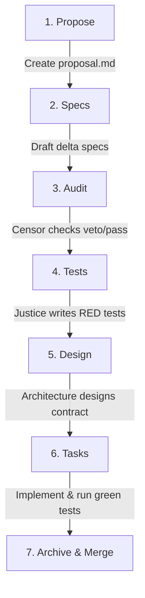

# OpenSpec Workspace Guide & Usage Manual

This directory houses the AI-agent operating model and system specifications for this repository, adhering to the [OpenSpec framework specification](https://openspec.dev/). It establishes a structured, Spec-Driven Development (SDD) process that enforces requirements, accessibility standards, and test-driven design.

---

## Directory Structure

```text
openspec/
├── config.yaml             # Project-level OpenSpec configuration
├── README.md               # This guide
├── specs/                  # Canonical specification baseline (Source of Truth)
│   ├── api/spec.md         # API Specification Document
│   └── ui/spec.md          # UI Specification Document
├── changes/                # Active change proposals
│   ├── active-proposal/    # Workspace for an in-flight change
│   └── archive/            # Historical record of completed and merged changes
├── roles/                  # Markdown files defining AI Agent responsibilities
├── rules/                  # Static governance policies & merge rules
└── schemas/                # Stage process definitions and templates
    └── enterprise/
        ├── schema.yaml     # Stage dependencies configuration
        └── templates/      # Base markdown files for each change stage
```

---

## Core Principles of OpenSpec

1. **Spec Before Code (SDD)**: No implementation code can be written or merged without a corresponding requirement ID, acceptance criteria, and a verified failing (RED) unit test.
2. **Context Isolation**: When proposing a change, agents must declare `context_bounds` in their proposals. They are strictly prohibited from editing code outside those boundaries.
3. **Invariants Enforcement**: Non-negotiable system rules (such as accessibility targets, naming conventions, or style limits) must be defined and validated for every change.
4. **Traceability**: Every functional requirement (`FR-*`) must trace directly to a test case (`TC-*`) and have its implementation status updated in the main traceability matrix upon completion.

---

## The OpenSpec Change Workflow

We use the **Enterprise Schema** to move a change from initial idea to production.



### Stage 1: Proposal (`proposal.md`)
* **Role**: **Product Scope Agent**
* **Action**: Explain *why* the change is needed. Define the target `context_bounds` and compile the `invariants` that must not be broken.

### Stage 2: Specifications (`specs/*.spec.md`)
* **Role**: **UX Accessibility & Domain Agents**
* **Action**: Define user journeys, scenarios, accessibility roles, and components using **Given/When/Then** format. Link every behavior to a unique requirement ID (e.g. `FR-001`, `NFR-002`).

### Stage 3: Audit (`audit.md`)
* **Role**: **The Censor**
* **Action**: Reviews the proposal and specs. Checks for ambiguous language (e.g., "seamless", "intuitive") and scope creep. Must status the change as ✅ **PASS** or ❌ **VETO** with reasons.

### Stage 4: Tests (`tests.md`)
* **Role**: **The Justice**
* **Action**: Write automated test assertions based on the specifications. **Verify that the tests fail (RED)** on the current codebase before implementation starts.

### Stage 5: Design (`design.md`)
* **Role**: **Architecture Agent**
* **Action**: Document the technical approach, data flow diagrams, contract signatures (props, events), and note any required Architecture Decision Records (ADRs).

### Stage 6: Tasks (`tasks.md`)
* **Role**: **Delivery Agent & Mason**
* **Action**: Formulate a checklist of tasks. The implementer (Mason) executes the code, turns the tests green (PASS), updates Storybook, and records progress in the **Ledger** table.

### Stage 7: Archive & Merge
* **Role**: **Delivery Agent / Maintainer**
* **Action**: 
  1. Merge the delta specs from the change directory into the main spec file (e.g., `openspec/specs/ui/spec.md`).
  2. Update the main spec's **Traceability Matrix** and **Change Log**.
  3. Move the change directory to `openspec/changes/archive/<change-name>`.

---

## Agent Handoff Protocol

To ensure seamless coordination between stage agents, every handoff must use the [Handoff Template](file:///openspec/schemas/enterprise/templates/handoff-template.md) containing:
1. **Inputs Consumed** (e.g., specifications reviewed)
2. **Artifact Updates** (e.g., test files created)
3. **Requirement IDs Impacted**
4. **Assumptions & Risks**
5. **Next Agent Action Required**

---

## Tooling & Verification

### Synchronisation Checks
If you create temporary local mirrors of role/workflow/template files inside a spec directory, verify that they are not drifting from their canonical sources using the sync utility:

```bash
openspec/scripts/check-agents-sync.sh --all
```

* Run `openspec/scripts/check-agents-sync.sh --domain <domain-name>` to target a single domain spec.
