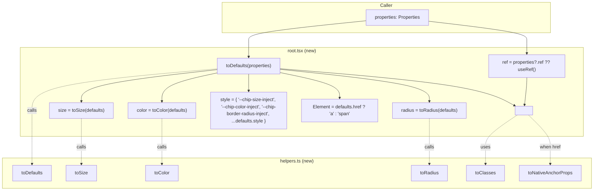

# Design: Refactor Chip Component to Match Checkbox Pattern

## Technical Approach

The refactor is a mechanical alignment of the Chip component's file structure, type system, and DOM-update mechanism to the conventions already established by the Checkbox component. No behavioral or visual changes are introduced. The work decomposes into four mechanical passes:

### Pass 1 — Filesystem rename

Pure `git mv` operations to bring the directory layout in line with `checkbox/`:

| From                                      | To                                            |
| ----------------------------------------- | --------------------------------------------- |
| `chip/chip.tsx`                           | `chip/root.tsx`                               |
| `chip/helpers.tsx`                        | `chip/helpers.ts`                             |
| `chip/__test__/chip.test.tsx`             | `chip/__tests__/chip.test.tsx`                |
| `chip/__test__/` (empty)                  | (removed)                                     |
| `chip/styles/state.css`                   | `chip/styles/states.css`                       |

The `styles/index.css` `@import` line for the renamed file is updated.

### Pass 2 — `helpers.ts` (no JSX)

The file already contains only pure functions (`toDefaults`, `toSize`, `toRadius`, `toColor`, `toClasses`). After renaming the extension from `.tsx` to `.ts`, the file body needs two adjustments:

1. Export a `DefaultedProperties` type alias to give `toDefaults` a precise return type, mirroring `checkbox/helpers.ts:26-27`:
   ```ts
   export type DefaultedProperties = Properties &
     Required<Pick<Properties, 'role' | 'children' | 'label' | 'color' | 'variant' | 'size' | 'radius' | 'icon' | 'avatar' | 'href' | 'target' | 'selected' | 'disabled' | 'className' | 'onClick' | 'onRemove' | 'onToggle'>>;
   ```
2. Add a `toNativeAnchorProps(properties?)` helper that returns a plain object suitable for spreading onto an `<a>` element. It omits all chip-specific keys (mirror of `BASE_PROPERTY_KEYS` in `checkbox/helpers.ts:7-24`). Anchor-specific keys (`href`, `target`) are kept.

### Pass 3 — `types.ts` (collapse the union)

Delete the `*ExcludedProperties` type aliases (lines 5-8), the `*Properties` per-role interfaces (lines 187-212), and the `ChipsProperties` union (line 217). Keep only the single `Properties` interface. Add a `@remarks` JSDoc tag to `avatar`, `onRemove`, `onToggle`, and the suggestion-role `icon` prop to document the silent-no-op behavior.

### Pass 4 — `root.tsx` (declarative style, fewer effects)

Replace the `useMemo`+`useLayoutEffect` block with a `style` object and pass `aria-disabled`/`aria-pressed` as props. The element-type discriminator (`a` vs `span`) is preserved.

#### Before (chip.tsx lines 21-47)

```ts
const reference = useRef<HTMLElement | null>(null);
const Element = defaults.href ? 'a' : 'span';
const { radius, color, size } = useMemo(() => ({...}), [defaults]);

useLayoutEffect(() => {
  if (!reference.current) return;
  if (defaults.disabled) reference.current.setAttribute('aria-disabled', 'true');
  if (defaults.selected) reference.current.setAttribute('aria-pressed', 'true');
  if (radius) reference.current.style.setProperty('--chip-border-radius-inject', radius);
  reference.current.style.setProperty('--chip-color-inject', color);
  reference.current.style.setProperty('--chip-size-inject', `${size}px`);
}, [defaults.disabled, defaults.selected, radius, color, size]);
```

#### After (root.tsx)

```ts
const ref = properties?.ref ?? useRef<HTMLElement | null>(null);
const size = toSize(defaults);
const color = toColor(defaults);
const radius = toRadius(defaults);
const Element: 'a' | 'span' = defaults.href ? 'a' : 'span';

const style = {
  '--chip-size-inject': `${size}px`,
  '--chip-color-inject': color,
  '--chip-border-radius-inject': radius,
  ...properties?.style,
} as React.CSSProperties;
```

The rendered JSX uses `style={style}`, `aria-disabled={defaults.disabled}`, and `aria-pressed={defaults.selected || undefined}` directly. The `ref` is passed as a prop (React 19 pattern). When `Element` is `'a'`, `toNativeAnchorProps(defaults)` is spread to provide only valid anchor attributes (mirrors `checkbox/root.tsx:23` calling `toNativeProperties`).

## Architecture Decisions

- **Decision**: Collapse the `ChipsProperties` discriminated union into a single `Properties` interface.
  - **Rationale**: The union's variant types (`AssistProperties`, etc.) do not actually narrow anything — every variant allows every chip-specific prop, with the same `role` discriminator. The union was structural noise that provided no compile-time benefit (no `never` returns, no `as` chain). The runtime already silently ignores out-of-role props; documenting that behavior in JSDoc is the right level of abstraction.
  - **Alternatives considered**:
    - *Keep the union, export only `Properties` as a type alias.* Rejected: dead code. The variants would exist only for `JSDoc` autocomplete, which we can put directly on the props.
    - *Build a per-role type with `never` on excluded props.* Rejected: the runtime doesn't enforce this; we'd have a type system that lies about runtime behavior. The chip has no `Omit<..., 'avatar'>` that actually rejects `avatar` at compile time today.

- **Decision**: Replace `useRef` + `useLayoutEffect` DOM mutation with a declarative `style` object.
  - **Rationale**: The CSS-variable injection via `setProperty` was a workaround for an older React idiom. React 19 (and the `react-component-standards` skill) explicitly recommends passing CSS custom properties through the `style` prop. This also removes an entire effect, a `useMemo`, and a callback ref, shrinking the component from ~97 lines to ~75 lines.
  - **Alternatives considered**: *Keep `useLayoutEffect` for SSR safety.* Rejected: the variables are purely cosmetic; on first paint they read from `variables.css` defaults, then re-render with the injected values. There is no measurable FOUC and no SSR-critical data here. If SSR proves to be an issue, a follow-up can revisit.

- **Decision**: Keep the `<a>`/`<span>` runtime element switching instead of mandating a single element.
  - **Rationale**: This is the existing public API surface (`href` triggers an anchor; absence triggers a span). Changing it would break consumer code and stories. The refactor preserves it; only the typing of the result improves.

- **Decision**: Rename `state.css` → `states.css` (plural).
  - **Rationale**: The fluent-css skill's `responsibility.md` calls this file `states.css` (plural) and so does `checkbox/styles/states.css`. Consistency wins.

- **Decision**: Move test from `__test__/` to `__tests__/` even though `text/` and `chip/` (the latter) also use singular.
  - **Rationale**: The `react-component-standards` skill defines the canonical layout with `__tests__/` (plural). `checkbox/` already follows this. Bringing `chip/` into alignment is more valuable than maintaining a 50/50 mix. `text/` should be normalized in a separate change to keep this one atomic.

## Data Flow



**Key insight**: the entire `useLayoutEffect` cycle from the old `chip.tsx` is gone. CSS variables flow declaratively from `style` → DOM in a single render pass. `aria-disabled` and `aria-pressed` are React props, not imperative `setAttribute` calls. The result is a side-effect-free render.

## Impact Analysis

- **Affected Files** (8 total):
  - `apps/ui/src/components/chip/chip.tsx` → renamed to `root.tsx`
  - `apps/ui/src/components/chip/helpers.tsx` → renamed to `helpers.ts`
  - `apps/ui/src/components/chip/types.ts` → edited
  - `apps/ui/src/components/chip/index.ts` → edited
  - `apps/ui/src/components/chip/__test__/chip.test.tsx` → moved to `__tests__/chip.test.tsx`
  - `apps/ui/src/components/chip/__stories__/chip.stories.tsx` → import path edit
  - `apps/ui/src/components/chip/styles/state.css` → renamed to `states.css`
  - `apps/ui/src/components/chip/styles/index.css` → `@import` updated

- **Dependencies**:
  - No new npm packages.
  - No changes to `package.json`, `tsconfig.json`, or workspace `project.json`.
  - Consumers of `apps/ui/src/components/chip/` are not affected (public API unchanged).
  - `apps/ui/src/components/icon/`, `apps/ui/src/components/text/` are imported but not modified.

- **Consumers** (must continue to work, not modified):
  - Any app that imports `Chip` from `apps/ui/src/components/chip` (e.g. Storybook stories, app pages). The default export from `index.ts` keeps the same name and shape.
  - The 28 tests in `chip.test.tsx` — all assertions remain valid; only the import line changes from `'../chip'` to `'../index'`.

- **Risks**:
  1. **TypeScript narrowing for `<a>` vs `<span>`**: the `Element` variable is typed as `'a' | 'span'`. Spreading `toNativeAnchorProps` onto it requires that the spread is permitted on the union. Mitigation: cast the element via `as React.ElementType` or branch the JSX. We will branch the JSX (cleaner, no casts).
  2. **`aria-pressed={undefined}`**: when `selected` is false, the old code did not set the attribute at all. React's behavior with `aria-pressed={false}` would set it to the string `"false"`, which is a *change* in behavior. Mitigation: pass `aria-pressed={defaults.selected || undefined}` so React omits the attribute when not selected.
  3. **`ref` callback vs object ref**: the old code used a callback ref `(element) => { reference.current = element }`. The new code uses `properties?.ref ?? useRef(...)`. If a consumer passes a callback ref, the new code's fallback `useRef` would be ignored — but the caller's callback would still receive the element. This is correct React 19 behavior and matches `checkbox/root.tsx:26`.
  4. **`__tests__/` was empty pre-refactor**: the test file currently lives in `__test__/` (singular). Moving it to `__tests__/` is safe because `__tests__/` is currently empty (no merge conflict).
